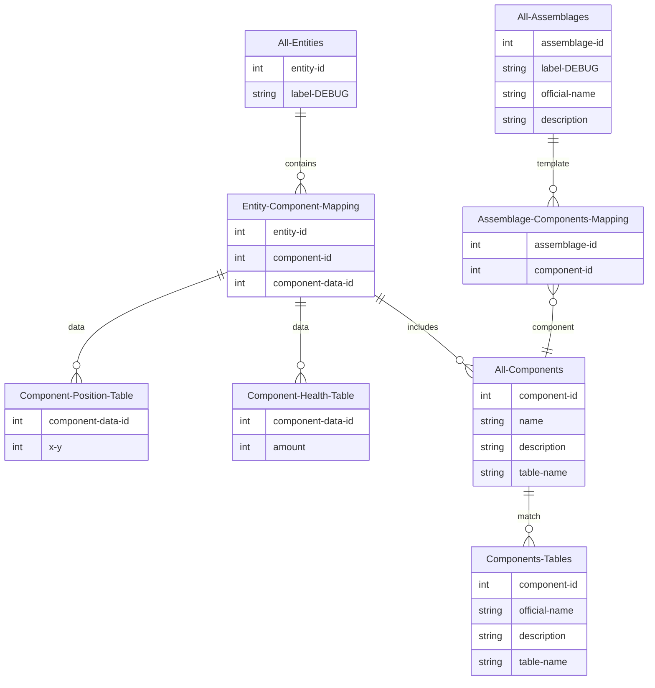

# BECS - Basic Entity Component System

Small project for learning purpuses.
The goal isn't to create a perfect ECS, but to understand the different intricacies of how ECS's work.

The ECS should be small and easy to understand, without external dependencies.

## Global Architecture plan:

## Maybe later

It could have some network system to better understand how to manage clients, within an ECS.